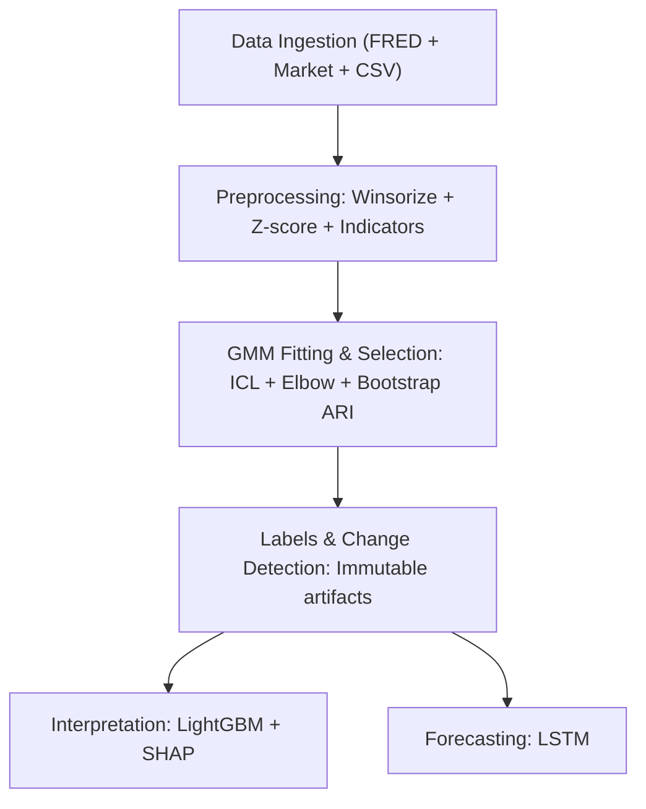

## Macro Regime Modeling Pipeline

A production-ready pipeline to detect, interpret, and forecast macro market regimes, with a fully featured Streamlit app for exploration and reporting.

### Highlights
- **End-to-end pipeline**: ingestion → preprocessing → GMM regime detection → label materialization/change detection → SHAP interpretation (LightGBM) → LSTM forecasting → signal publishing/monitoring → scheduling & reproducibility.
- **Rich data**: always fetches FRED macro data and market OHLCV (SPY, ES, NQ, VIX, DXY, TLT, GLD, USO), with optional user CSV merge or demo data.
- **Robust model selection**: ICL with elbow detection and bootstrap stability (ARI) checks.
- **Explainability**: SHAP feature importances with persisted artifacts.
- **Operational guardrails**: health checks, publication freeze, PagerDuty/SRE hooks, and execution manifests.

---

### Quickstart
1) Install dependencies
```bash
python -m venv .venv && source .venv/bin/activate
pip install -r requirements.txt
```

2) Launch the app
```bash
streamlit run app.py
```

3) In the sidebar:
- Configure date range, regime `k` search bounds, and advanced options
- Optionally paste your FRED API key or upload a CSV
- Click “Run Pipeline”

Tip: No data/API key? Check “Use demo data”.

---

### Architecture


---

### How it works
- **Data ingestion & preprocessing** (`core.py`)
  - Fetches FRED macro series (forward-filled to business days) and market OHLCV via Yahoo Finance.
  - Optional user CSV data is merged (inner join on `date`).
  - Handles missing values (limited forward-fill, then drop), adds technical indicators, winsorizes outliers, and z-scores features.
  - Persists `raw_snapshots/` and `processed_snapshots/` with hashes and metadata.

- **Regime detection (GMM) & selection** (`core.py`)
  - Fits GMMs for `k ∈ [k_min, k_max]` with multiple initializations.
  - Selects `k*` primarily by ICL with an elbow check on log-likelihood.
  - Validates stability via bootstrap ARI; enforces a minimum ARI threshold.
  - Saves candidates, labels, posteriors, and selection results.

- **Label materialization & change detection** (`analysis.py`)
  - Writes immutable labels table with per-regime posteriors, confidence, and entropy.
  - Detects event type (`reset` vs `incremental`) via `k*` change and ARI overlap with prior window.
  - Emits comprehensive sidecar metadata.

- **Interpretation (LightGBM + SHAP)** (`analysis.py`)
  - Cross-validated LightGBM training on features → regimes; persists model and SHAP results.
  - Reports top features by mean |SHAP|, with robust handling for multiclass outputs.

- **Forecasting (LSTM)** (`analysis.py`)
  - Sequence model predicts future regime with metrics: accuracy, directional accuracy, F1, and a simplified portfolio Sharpe.
  - Saves checkpoints and version info.

- **Signal publishing & monitoring** (`operations.py`)
  - Publishes a compact signal payload (latest regime, posteriors, transition matrix, top SHAP, model versions).
  - Health rules: bootstrap ARI, interpretation F1, and consecutive negative Sharpe; auto-freezes on breach, with PagerDuty and SRE hooks.

- **Scheduling & reproducibility** (`operations.py`)
  - Twice-yearly scheduling (January/July) with sliding windows and full seed control.
  - Emits execution manifests capturing inputs, outputs, and environment.

---

### Streamlit app tour (`app.py`)
- **Sidebar**
  - Data sources: FRED + market data; optional custom CSV; “Use demo data”.
  - Date range; `k` bounds and forced `k`; advanced controls (seed, bootstrap samples, ARI threshold, dry-run).
  - Optional FRED key input.

- **Results**
  - Key metrics: `k*`, current regime + confidence, bootstrap ARI, interpretation F1, forecast Sharpe.
  - Tabs:
    - **Regime Timeline**: feature overlays, regime shading, posterior stacks, regime stats.
    - **Model Selection**: LogL, BIC, ICL, AIC vs `k`, with selected point highlighted.
    - **Feature Importance**: top SHAP features, CV/validation metrics, category breakdowns.
    - **Regime Forecasts**: transition matrix heatmap, persistence/most-likely transitions, forecast plot.
    - **Data Explorer**: correlations, time-series with regime overlay, samples.
    - **Export**: CSV/JSON downloads and a text summary report.

---

### Configuration
- **Environment variables** (use a `.env` file or set in your shell):
  - `FRED_API_KEY`: for real FRED queries (UI can accept this too).


- **Advanced app options**
  - Skip monitoring, dry-run publication, bootstrap samples, ARI threshold, and forced `k`.

---

### Outputs & artifacts
- **`gmm_candidates/`**: fitted GMM models and serialized candidates.
- **`selection_results/`**: JSON with selection metadata and diagnostics.
- **`regime_labels/`**: immutable CSV/JSON label artifacts and posteriors.
- **`interpretation_models/`**: LightGBM models and version files.
- **`shap_explanations/`**: SHAP values and top features JSON.
- **`forecast_models/`, `forecast_checkpoints/`**: LSTM checkpoints and configs.
- **`monitoring_metrics/`**: health snapshots and publication freeze file.
- **`execution_manifests/`**: step-level input/output/environment hashes.

---

### Data sources
- **FRED**: macro series (e.g., GDP, unemployment, CPI, PCE, fed funds, yields, IP, retail sales, sentiment, M2, housing starts). Values are forward-filled to business days and merged.
- **Yahoo Finance**: OHLCV and derived features for `SPY`, `ES=F`, `NQ=F`, `^VIX`, `DX-Y.NYB`, `TLT`, `GLD`, `USO`.
- **Custom CSV**: merged on `date` (prefixed as `user_...`).

---

### Project structure
- `core.py`: ingestion, preprocessing, GMM fitting/selection, snapshots.
- `analysis.py`: label materialization, change detection, LightGBM + SHAP, LSTM.
- `operations.py`: signal publishing, monitoring, scheduling, reproducibility.
- `optimization_utils.py`: parallelization, memmap bootstrap, memory monitoring.
- `data_connectors.py`: optional connectors for Yahoo/FRED/CSV and combined store.
- `app.py`: Streamlit UI with rich visualization and export options.
- `generate_demo_data.py`: synthetic data generator for testing/demo.
- `requirements.txt`: Python dependencies.

---

### Notes & recommendations
- For real FRED usage, set `FRED_API_KEY`. Otherwise, enable “Use demo data”.
- Torch will use GPU if available; CPU-only works fine for moderate datasets.
- Bootstrap validation and multi-`k` GMM fitting are parallelized and memory-aware.

---

### License
Add a license file (e.g., MIT) if distributing or sharing publicly.


